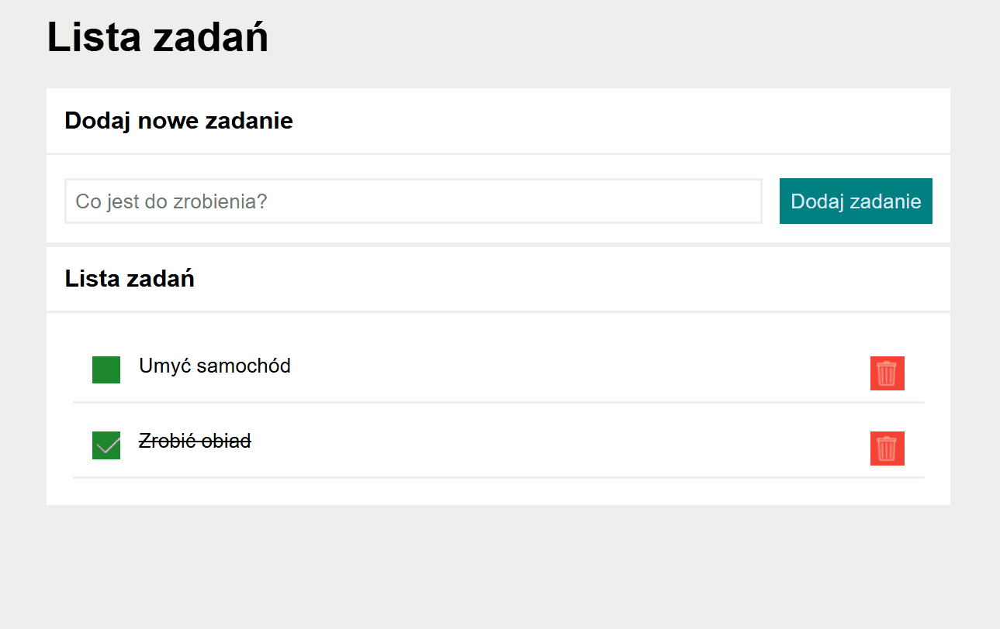

# Homework mod06

## Description

Welcome in my project! 
This project is list tasks. You can use application, this project to add your tasks. You can mark this task that it is done, or unmark it is undone when you click on green button. You can delete your task on the list task, when you click red button on the right. 
Enjoy my project

## Link to application site under

[Link do aplikacji](https://lukaswebdeveloper.github.io/homework_mod06/)

## Screen gif site

## Technology used in this project
- HTML
- - Bem 
- - CamelCase
- CSS
- - Flex
- JS
- - Functions
- - Tables
- - Objects